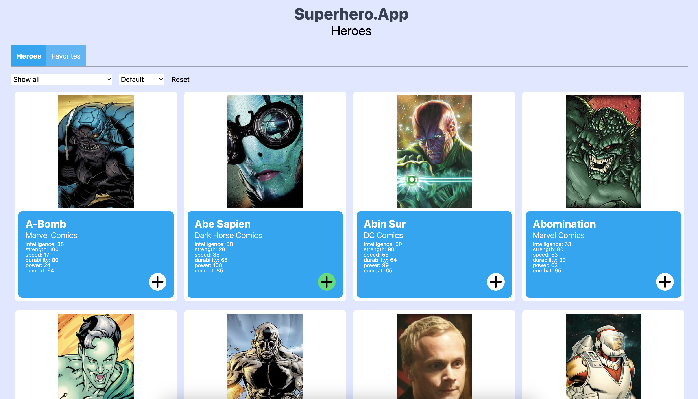

# 🦸 Superhero App
This was another exciting homework!
I've built a simple yet functional web application using Vite, React, TypeScript, and Tailwind CSS that displays a list of superheroes. Users can explore them, filter by publisher, sort by power stats, and manage a list of their favorites. 
## Features
The application provides the following features:

- Displays a list of superheroes in card format
- Ability to **add/remove** heroes to/from favorites
- Favorites section that persists data via `localStorage`
- **Filtering** by publisher (e.g. *Marvel*, *DC Comics*, etc.)
- Sorting functionality by Powerstats (e.g. *intelligence*, *strength*, etc.)
- **Infinite scroll** – initially displays 10 cards, and loads more as you scroll down to improve performance
- Clean, responsive, minimalist UI for clarity and ease of use
- Data cleanup: Filtered out heroes with empty or duplicate publishers for a consistent filter list

## Tech Stack & Libraries
The project setup was done using Vite for its fast build times and efficient developer workflow. Here's what I used:

- React for building UI components
- TypeScript for type safety and better development experience
- Tailwind CSS for rapid UI styling and utility-first CSS
- LocalStorage API to persist favorite heroes between sessions
- Custom hooks for state and logic separation (e.g. favorites, filters)

## API
This project uses the Superhero Database API, which provides superhero data through static JSON files:

- All heroes: https://akabab.github.io/superhero-api/api/all.json

## Future Improvements
- ```React.memo``` for components that don't need frequent re-renders
- Unit testing with Jest
- More visual stats representation
- Dark mode toggle
- Animations when loading more content

## Getting Started
Clone the repository and run the following commands to get it up and running:
### Install dependencies
```
npm install
```
### Start development server
```
npm start
```
### Build for production
```
npm build
```

## Deployment
The app is currently not deployed. You can run it locally by following the setup instructions above.

## Screenshots


## Credits
API used: [Superhero API](https://akabab.github.io/superhero-api)

Built with ❤️ by Benjamin Gal © 2025 – https://codeapp.hu